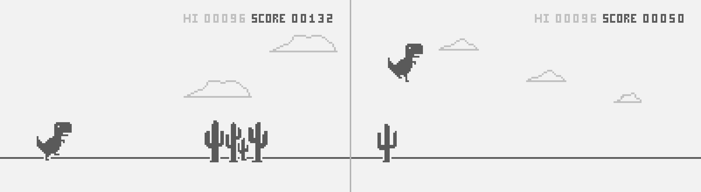
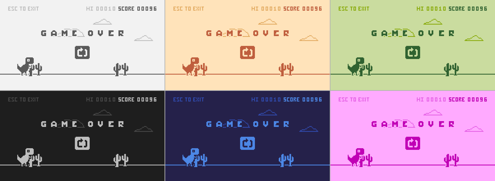

> [!NOTE]
> ### 🎓 This is a student project which won't be further updated.
> > **Finished:** `01.2023`
>
> This repository is read-only and works as an archive for this project.
>
> Despite this, downloading the files and running the application is encouraged. I would be happy if this project ended up as help or inspiration.
 

# Dino Game

A recreation of the [offline dinosaur game](https://en.wikipedia.org/wiki/Dinosaur_Game) from Google Chrome, made using C++. Despite being a console application, it has a fake pixel display made by setting background colors for pairs of ASCII characters displayed on screen.

As a personal touch I've added an option to change the color palette. All available palettes:

 

## 🛠 Setup

To downoad the application, either:

- Download the `.exe` file from [Releases](../../releases/latest)
- Clone/download the repository, and [create a release build in Visual Studio](https://learn.microsoft.com/en-us/cpp/build/how-to-create-a-release-build?view=msvc-170) which should result in an `.exe` file

 

## 🎮 Controls

- <kbd>Space</kbd> - Jump
- <kbd>←</kbd> - Previous color palette
- <kbd>→</kbd> - Next color palette
- <kbd>Escape</kbd> - Exit

### Bonus Controls 

A side effect of how the fake pixel display is implemented.

- <kbd>Ctrl + Mouse Wheel</kbd> - Zoom
- <kbd>Mouse Select</kbd> - Highlight characters (half a pixel each)
